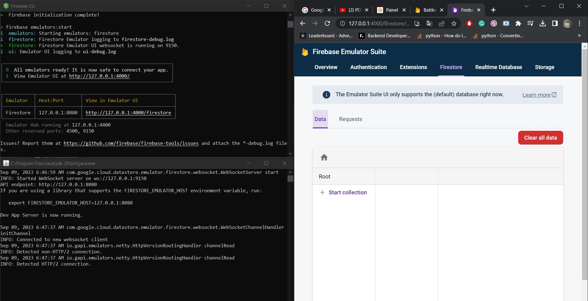

# Firebase Emulator Commands

## [Connect your app and start prototyping](https://firebase.google.com/docs/emulator-suite/connect_and_prototype?database=Firestore)

[Connect your app to the Cloud Firestore Emulator](https://firebase.google.com/docs/emulator-suite/connect_firestore)

- [firebase-tools](https://github.com/firebase/firebase-tools)

 firebase login

 firebase projects:list

``` 
    firebase init
    
    - Select "Firestore: Configure security rules and indexes files for Firestore"

    Using project battleship-ee (Battleship EE)
    Using firestore.rules
    Using firestore.indexes.json
    Firebase initialization complete!

    firebase emulators:start
    
```

|Emulator|Host:Port|View in Emulator|
|-|-|-|
|Firestore|127.0.0.1:8080|http://127.0.0.1:4000/firestore|



```kotlin
// 10.0.2.2 is the special IP address to connect to the 'localhost' of
// the host computer from an Android emulator.
private val emulatedFirestoreDb: FirebaseFirestore by lazy {
    Firebase.firestore.also {
        it.useEmulator("10.0.2.2", 8080)
        it.firestoreSettings = FirebaseFirestoreSettings.Builder()
            .setPersistenceEnabled(false)
            .build()
    }
}
```

