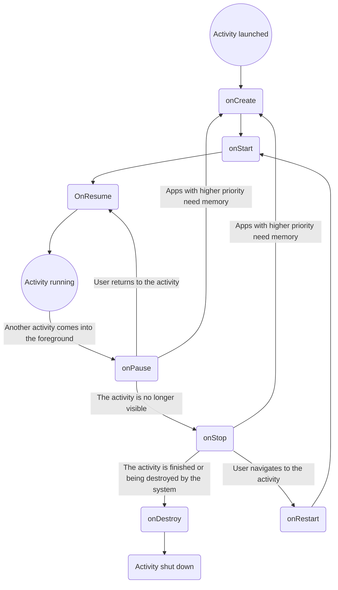
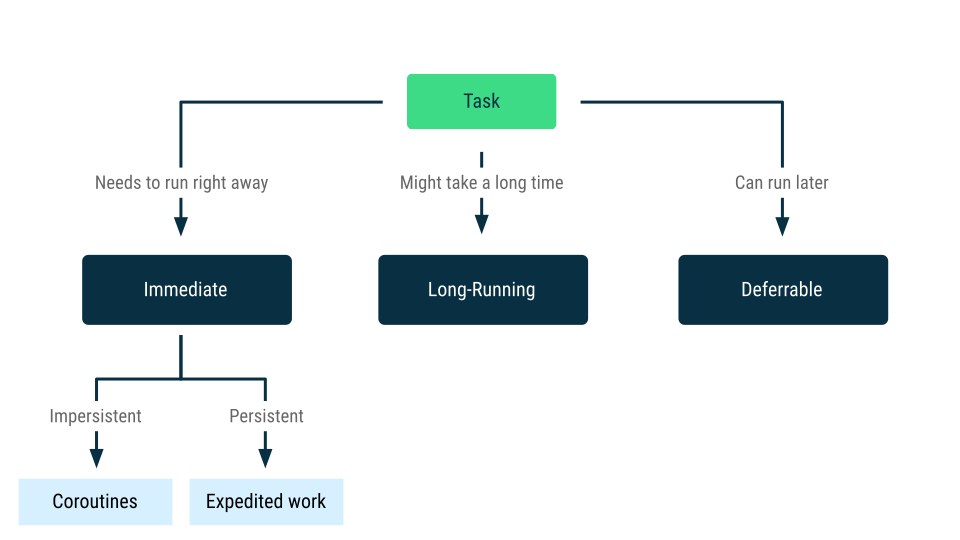

# Época Especial Programação Dispositivos Móveis

---

## Execução em Android: Introdução

# Inversion of Control

## Library vs Framework

It then decides when to call my methods, based on the bindings i made when creating the form. The control is inverted- it calls me rather then me calling the framework. Ths phenomenon is Inversion of Control (also known as the Hollywood Principle - "Don't call us, we'll call you")

Inversion of Control is a key part of what makes a framework different to a library. A library is essentially a set of functions that you can call, these days usually organized into classes. Each call does some work and returns control to the client.

A framework embodies some abstract design, with more behavior built in. In order to use it you need to insert your behavior into various places in the framework either by subclassing or by plugging in your own classes. The framework's code then calls code at these points.

# [Activity](https://developer.android.com/guide/components/activities/intro-activities)

- The Activity as an execution host
- Elementary lifecycle: onCreate, on Start, on Stop and onDestroy
- Threading model

Unlike programming paradigms in which apps are launched with a main() method, the Android system initiates code in an Activity instance by invoking specific callback methods that correspond to specific stages of its life.

When one app invokes another, the calling app invokes an activity in the other app, rather than the app as an atomic whole. In this way, the activity serves as the entry point for an app's interaction with the user.

- [Lifecycle](https://developer.android.com/guide/components/activities/activity-lifecycle)

## The activity lifecycle

The Activity class provides a core set of six callbacks:



As the user begins to leave the activity, the system calls methods to dismantle the activity. In some cases, the activity is only partially dismantled and still resides in memory, such as when the user switches to another app. In these cases, the activity can still come back to the foreground.

### Lifecycle callbacks

#### onCreate()

Fires when the system first create the activity. This method receives the parameter savedInstanceState, which is a ``Bundle`` object containing the activity's previously saved state. If the activity has never existed before,the value of the ``Bundle`` object is null

- Bundle is a class in android which is used to pass from one activity to another activity within an android application. We can pass data using key and value pairs using bundles.

- Your activity does not remain in the Created state. After the onCreate() method finishes execution, the activity enters the Started state and the system calls the onStart() and onResume() methods in quick session

#### onStart()

- When the activity enters the Started state, the system invokes onStart(). This call makes the activity visible to the user as the app prepares for the activity to enter the foreground and become interactive. For example, this method is where the code that maintains the UI is initialized.

#### onResume()

- When tha activity enters the Resumed state, it comes to the foreground, and the system invokes the onResume() callback. This is the state in which the app interacts with the user. The app stays in this state until something happens to take focus away from the app, such as the device receiving a phone call, the user navigating to another activity, or the device screen turning off.

#### onPause()

- The system calls this method as the first indication that the user is leaving your activity, though it does not always mean the activity is being destroyed. It indicates that the activity is no longer in the foreground, but it is still visible if the user is in multi-window mode. There are several reasons why an activity might enter this state:

  - An event that interrupts app execution, as described in the section about the onResume() callback, pauses the current activity. This is the most common case.
  - In multi-window mode, only one app has focus at any time, and the system pauses all the other apps.
  - The opening of a new, semi-transparent activity, such as a dialog, pauses the activity it covers. As long as the activity is partially visible but not in focus, it remains paused.

- onPause() execution is very brief and does not necessarily offer enough time to perform save operations. For this reason, don't use onPause() to save application or user data, make network calls, or execute database transactions. Such work might not complete before the method completes.

- Instead, perform heavy-load shutdown operations during onStop(). For more information about suitable operations to perform during onStop(), see the next section. For more information about saving data, see the section about saving and restoring state.

- Completion of the onPause() method does not mean that the activity leaves the Paused state. Rather, the activity remains in this state until either the activity resumes or it becomes completely invisible to the user. If the activity resumes, the system once again invokes the onResume() callback.

- If the activity returns from the Paused state to the Resumed state, the system keeps the Activity instance resident in memory, recalling that instance when the system invokes onResume(). In this scenario, you don’t need to re-initialize components created during any of the callback methods leading up to the Resumed state. If the activity becomes completely invisible, the system calls onStop().

#### onStop()

- When your activity is no longer visible to the user, it enters the Stopped state, and the system invokes the onStop() callback. This can occur when a newly launched activity covers the entire screen. The system also calls onStop() when the activity finishes running and is about to be terminated.

- In the onStop() method, release or adjust resources that are not needed while the app is not visible to the user. For example, your app might pause animations or switch from fine-grained to coarse-grained location updates. Using onStop() instead of onPause() means that UI-related work continues, even when the user is viewing your activity in multi-window mode.

- Also, use onStop() to perform relatively CPU-intensive shutdown operations. For example, if you can't find a better time to save information to a database, you might do so during onStop().

#### onDestroy()

- onDestroy() is called before the activity is destroyed. The system invokes this callback for one of two reasons:

  - The activity is finishing, due to the user completely dismissing the activity or due to finish() being called on the activity.
  - The system is temporarily destroying the activity due to a configuration change, such as device rotation or entering multi-window mode.

### Saving and restoring transient UI state

- A user expects an activity’s UI state to remain the same throughout a configuration change, such as rotation or switching into multi-window mode. However, the system destroys the activity by default when such a configuration change occurs, wiping away any UI state stored in the activity instance.

- When system constraints destroy the activity, preserve the user’s transient UI state using a combination of ViewModel, onSaveInstanceState(), and/or local storage. To learn more about user expectations compared to system behavior and how to best preserve complex UI state data across system-initiated activity and process death, see Save UI states.

### Starting one activity from another

- Depending on whether or not your activity wants a result back from the new activity it’s about to start, you start the new activity using either the startActivity() method or the startActivityForResult() method. In either case, you pass in an Intent object.

- The Intent object specifies either the exact activity you want to start or describes the type of action you want to perform. The system selects the appropriate activity for you, which can even be from a different application. An Intent object can also carry small amounts of data to be used by the activity that is started.

### Coordinating activities

- Here's the order of operations that occur when Activity A starts Activity B:

- Activity A's onPause() method executes.
- Activity B's onCreate(), onStart(), and onResume() methods execute in sequence. Activity B now has user focus.
- If Activity A is no longer visible on screen, its onStop() method executes.

# [Application fundamentals](https://developer.android.com/guide/components/fundamentals#Components)

- The Android operating system is a multi-user Linux system in which each app is a different user.

- By default, the system assigns each app a unique Linux user ID, which is used only by the system and is unknown to the app. The system sets permissions for all the files in an app so that only the user ID assigned to that app ca access them.

- Each process has its own virtual machine (VM), so an app's code runs in isolation from other apps.

- By default, every app runs in its own Linux process. The Android system starts the process when any of the app's components need to be executed, and then shuts down the process when it's no longer needed or when the system must recover memory for other apps.

- The Android system implements the _principle of least privilege_. That is, each app, by default, has access only to the components that it requires to do its work and no more. This creates a very secure environment in which an app can't access parts of the system it is not given permission for.

- However, there are ways for an app to share data with other apps and for an app to access system services:

  - It's possible to arrange for 2 apps to share the same Linux user ID, which case they are able to access each other's files. To conserve system resources, apps with same user ID can also arrange to run in the same Linux process and share the same VM. The apps must also be signed with the same certificate.

  - An app can request permission to access device data such as the device's location

## App components

- App components are the essential building blocks of an Android app. Each component is an entry point through which the system or a user ca enter your app. Some components depend on others.

- There 4 types of app components:
  - Activities
  - Services
  - Broadcast receivers
  - Content providers

### Activities

- An activity is the entry point for interacting with the user. It represents a single screen with a user interface.

- An activity facilitates the following key interactions between system and app:
  - Keeping track of what the user currently cares about - what is on screen - so that the system keeps running the process that is hoisting the activity.

  - Knowing which previously used processes contain stopped activities the user might return to and prioritizing those processes more highly to keep them available.

  - Helping the app handle having its process killed so the user can return to activities with their restored.

  - Providing a way for apps to implement user flows between each other, and for the system to coordinate these flows. The primary example is sharing.

### Services

- A service is a general-purpose entry point for keeping an app running in the background for all kinds of reasons. It is a component that runs in the background to perform long-running operations or to perform work for remote processes. A service does not provide a user interface.

  - For example, a service might play music in the background while the user is in a different app, or it might fetch data over the network without blocking user interaction with an activity. Another component, such as an activity, can start the service and let it run or bind to interact with it

  Two types of services

  - Started service: tell the systems to keep them running until their work is completed. This might be to sync some data in the background or play music even after the user leaves the app.
    - Music playback is something the user is directly aware of, and the app communicates this to the system by indicating that it wants to be in the foreground, with a notification to tell the user is running. In this case, the system prioritizes keeping that service's process running, because the user has a bad experience if it goes away.
    - A regular background service is not something the user is directly aware of, so the system has more freedom in managing its process. It might let be killed. restarting the service sometime later, if ti need RAM for things that are of more immediate concern.

- Bound services run because some other app (or the system) has said that it wants to make use of the service. A bound service provides an API to another process, and the system knows there is a dependency between these processes. So if process A is bound to a service in process B, the system knows that it needs to keep process B and its service running fo A. Further, if process A is something the user cares about, then it knows to treat process B as something the user also cares about.

  - Because of their flexibility, services are useful building blocks for all kinds of higher-level system concepts.

  - Note: JobScheduler class to schedule actions. JobScheduler has the advantages of conserving battery by optimally scheduling jobs to reduce power consumptions.

- Broadcast receivers is a component that lets the system deliver events to the app outside of a regular user flow so the app can respond to system-wide broadcast announcements. The system can deliver broadcasts even to apps that aren't currently running

- Content providers manages a shared set of app that you can store in the file system, in a SQLite database, on the web, or any other persistent location that your app can access. Through the content provider, other apps can query or modify the data, if the content provider permits it

- When the system starts a component, it starts the process for that app, if it's not already running, and instantiates the classes needed for the component. For example, if your app starts the activity in the camera app that captures a photo, that activity runs in the process that belongs to the camera app, not your app's process. Therefore, unlike apps on most other systems, Android apps don't have a single entry point: there's no main() function.

- Because the system runs each app in a separate process with file permissions that restrict access to other apps, your app can't directly activate a component from another app. However, the Android system can. To activate a component in another app, you deliver a message to the system that specifies your _intent_ to start a particular component. The system then activates the component for you.

- Activate components
  - An asynchronous message called an intent activates three of the four component types: activities, services, and broadcast receivers. Intent bind individual components to each other at runtime. You can think of them as the messengers that request an action from other components, whether the component belongs to your app or another
  - An intent is created with an Intent object, which defines a message to activate either a specific component (an _explicit_ intent) or a specific type of component (an _implicit_ intent)
  - For activities and services, an intent defines the action to perform, such as to view or send something, and might specify the URI of the data to act on, among other things that the component being started might need to know.
  - For example, an Intent might convey a request for an activity to show an image or to open a web page. In some cases, you can start activity to receive a result, in which case the activity also returns the result in an Intent. You can also issue an intent to let the user pick a personal contact and have it returned to you. The return intent includes a URI pointing to the chosen contact.
  - For broadcast receivers, the intent defines the broadcast announcement. For example, a broadcast to indicate that the device battery is low includes only a known string action that indicates _battery is low_

## The manifest file

- Before the Android system can start an app component, the system must know that the component exists by reading the app's manifest file. Your app declares all its components in this file, which is the root of the app project directory.

  - Identifies any user permissions the app requires, such as internet access or read-access to the user's contacts
  - Declares the minimum API level required by the app, such as a camera Bluetooth services, or a multitouch screen.
  - Declares API libraries the app needs to be linked against (other than the Android framework APIs), such as the Google Maps library.

- [Threading model](https://developer.android.com/guide/components/processes-and-threads#Threads)

# Processes and threads overview

- When an application component starts and the application doesn't have any other components running, the Android system starts a new Linux process for the application with a single thread of execution. By default, all components of the same application run in the same process and thread, called the _main_ thread

- If an application component starts and there is already a process for that application, because another component from the application already started, then the component starts within that process and uses the same thread of execution. However, you can arrange for different components in your application to run in separate processes, and you can create additional threads for any process.

## Processes

- By default, all of an application's components run in the same process, and most applications don't change this. However, if you find that you need to control which process a certain component belongs to, you can do so in the manifest file.

- android:process attribute that can specify a process the component runs in. You can set this attribute so that each component runs its own process or so that some components share a process while others don't.

- You can also set android:process so that components of different applications run in th same process, provided that the applications share the same Linux user ID and are signed with the same certificates.

- Android might decide to shut down a process at some point, when resources are required by other processes that are more immediately serving the user. Application components running in the process that's shut down are consequently destroyed. A process is started again for those components when there's work for them to do.

- When deciding which processes to shut down, the Android system weighs their relative importance to the user. For example, it more readily shuts down a process hosting activities that are no longer visible on screen, compared to a process hosting visible activities. The decision of whether to terminate a process, therefore, depends on the state of the components running in that process.

## Threads

When an application is launched, the system creates a thread of execution for the application, called the main thread. This thread is very important, because it is in charge of dispatching events to the appropriate user interface widgets, including drawing events. It is also almost always the thread in which your application interacts with components from the Android UI toolkit's android.widget and android.view packages. The main thread is also called UI thread. However, under special circumstances, an app's main thread might not be its UI thread.

- The system does not create a separate thread for each instance of a component. All components are dispatched from that thread. Consequently, methods that respond to system callbacks - such as __onKeyDown()__ to report user actions, or a lifecycle callback - always run in the thread of the process.

- For instance, when the user touches a button on the screen, you app's UI thread dispatches the touch event to the widget, which in turn sets its pressed state and posts an invalidate request to event queue. The UI thread dequeues the request and notifies the widget to redraw itself.

- Unless you implement your application properly, this single-thread model can yield poor performance when your app performs intensive work in response to user interaction. Performing long operations in the UI thread, such as network access ot database queries, blocks the whole UI. When the thread is blocked. no events can be dispatched, including drawing events.

- From the user's perspective, the application appears to hang. Even worse, if the UI thread is blocked for more than a few seconds, the user is presented with the Application Not Responding (ANR) dialog. The user might then decide to quit your application or even uninstall it.

- Bear in mind that the Android UI toolkit is not thread-safe. So, don't manipulate your UI from a worker thread. Do all manipulation to your user interface from the UI thread. There are 2 rules to Android's single-thread model:
  - Don't block the UI thread
  - Don't access the Android UI toolkit from outside the UI thread

### Worker threads

- Because of this single-thread model, it's vital to the responsiveness of your application's UI that don't block the UI thread. If you have operations to perform that aren't instantaneous, make sure to do them in separate background or worker threads. Just remember that you can't update the UI from any threads other than the UI, or main, thread.

  - Android offers several ways to access the UI threads from other threads:
    - Activity.runOnUiThread(Runnable)
    - View.post(Runnable)
    - View.postDelayed(Runnable, long)

- This implementation is thread-safe, because the background operation is done from a separate thread while the ImageView is always manipulated from the UI thread.

- However, as the complexity of the operation grows, this kind of code can get complicated and difficult to maintain. To handle more complex interactions with a worker thread, you might consider using a Handler in your worker thread to process messages delivered from the UI thread.

## Thread-safe methods

- In some situations, the methods you implement are called from more than one thread, and therefore must be written to be thread-safe.

- This is primarily true for methods that can be called remotely, such as methods in a bound service. When a call on a method implemented in an IBinder originated in the same process in which the IBinder is running, the method is executed in the caller's thread. However, when the call originated in another process, the method executes in  a thread chosen from a pool of threads that the system maintains in the same process as the IBinder. it's not executed in the UI thread of the process.

- For example, whereas a service's onBind() method is called from the UI thread of the service's process, methods implemented in the object that onBind() returns, such as a subclass that implements remote procedure call (RPC) methods, are called from threads in the pool. Because a service can have more than one client, more than one pool thread can engage the same IBinder method at the same time, so IBinder methods must be implemented to be thread-safe.

- Similarly, a content provider can receive data requests that originate in tje processes. The ContentResolver and ContentProvider classes hide the details of how the interprocess communication (IPC) is managed, but ContentProvider methods that respond to those requests - the methods query(), insert(), delete(), update(), and getType()-are called from a pool of threads in the content provider's process, not the UI thread for the process. Because these methods might be called from any number of threads at the same time, they too must be implemented to be thread-safe

## Interprocess communication

- Android offers a mechanism for IPC using RPCs, in which a method is called by an activity or other application component but executed remotely in another process, with any result returned back to the caller. This entails decomposing a method call and its data to a level the operating system and address space, and then reassembling and reenacting the call there.

- Return values are then transmitted in the opposite direction. Android provides all the code to perform these IPC transactions, so you can focus on defining and implementing the RPC programming interface.

To perform IPC, your application must bind to a service using bindService(). For more [Service overview](https://developer.android.com/guide/components/services)

## [Background Work Overview](https://developer.android.com/guide/background)

- Processing data in the background is an important part of creating an Android application that is both responsive for user as well as a good citizen on the Android platform. Doing work on the main thread can lead to poor performance and therefore a poor user experience.

- An app is running in the background when:
  - None of the apps's activities are currently visible ot the user.
  - The app isn't running any foreground services that started while a activity from the app was visible to the user.

Otherwise, the app is running in the foreground.

### Common types of background work

- Background categories:

  - Immediate: Needs to execute right away and complete soon.
  - Long Running: May take some time to complete.
  - Deferrable: Does not need to run right away.

- Background work categories:
  
  - Persistent work: Remains scheduled through app restarts and device reboots.
  - Impersistent work: No longer scheduled after the process ends.



- All persistent work: You should use WorkManager for all forms of persistent work.
- Immediate impersistent work: You should use Kotlin coroutines
- Long-running and deferrable impersistent work: You shouldn't use long-running and deferrable impersistent work. You should instead complete such tasks through persistent work using WorkManager.

|Category|Persistent|Impersistent|
|-|-|-|
|Immediate|WorkManager|Coroutines|
|Long-running|WorkManager|Not recommended. Instead, perform work persistently using WorkManager|
|Deferrable|WorkManager|Not recommended. Instead work persistently using WorkManager|

__Key Term__: Immediate impersistent work is essentially asynchronous work.

## [Services Overview](https://developer.android.com/guide/components/services)

A Service is an application component that can perform long-running operations in the background. It does not provide a user interface. Once started, a service might continue running for some time, even after the user switches to another application. Additionally, a component can bind to a service to interact with it and even perform interprocess communication(IPC). For example, a service can handle network transactions, perform file I/O, or interact with a content provider, all from the background.

__Caution__: A service runs in the main thread of its hosting process; the service does not create its own thread and does not run in separate process unless you specify otherwise. You should run any blocking operations on a separate thread within the service to avoid Application Not Responding (ANR) errors.

- A service is simply a component that can run in the background, even the user is not interacting with your application, so you should create a service only if that is what you need.

- Also consider using a thread pools and executors from the java.util.concurrent package or Kotlin coroutines instead of the traditional Thread class.

- Remember that if you use a service, it still runs in your application's main thread by default, so you should still create a new thread within the service if it performs intensive or blocking operations.

# Building a UI with Jetpack Compose: Introduction

- @Composable functions: State -> @Composable -> UI
- Stateless @Composables
  - Elementary composables: Text and Button
  - Layouts: Row, Column e Box
- Statefull @Composables: Introduction
  - State management: remember and mutableStateOf
  - State hoisting
- [Application resources](https://developer.android.com/guide/topics/resources/providing-resources)

- [Thinking in Compose | Jetpack Compose | Android Developers](https://developer.android.com/jetpack/compose/mental-model)

- Jetpack Compose is a modern declarative UI Toolkit for Android. Compose makes it easier to write and maintain your app UI by providing a declarative API that allows you to render your app UI without imperatively frontend views.

## The declarative paradigm shift

- Initialize the UI by instantiating a tree of widgets.You often do this by inflating an XML layout file. Eac widget maintains its own internal state, and exposes getter and setter methods that allow the app logic to interact with the widget.

- In Compose's declarative approach, widgets are relatively stateless and do not expose setter or getter functions. In fact, widgets are not exposed as objects. You update the UI by calling the same composable function with different arguments. This makes it easy to provide state to architectural patterns such as a ViewModel

The app logic provides data to the top-level composable function. That function uses the data to describe the UI by calling other composables, and passes the appropriate data to those composables, and on down hierarchy.

- When the user interacts with the UI, the UI raises events such as onClick. Those events should notify the app logic, which can then change the app's state. When the state changes, the composable functions are called again with the new data. This causes the UI elements to be redrawn -- this process is called recomposition

- The user interaCted with a UI element, causing an event to be triggered. The app logic responds to the event, then the combosable functions are automatically called again with the new parameters, if necessary.

## Dynamic content

## Recomposition

- Recomposition is the process of calling your composable functions again when inputs change. This happens when the function's inputs change. When Compose recomposes based on new inputs, it only calls the functions or lambda's that might have changed, and skips the rest. By skipping all functions or lambdas that don't have changed parameters, Compose can recompose efficiently

## Composable functions can execute in any order

- If a composable functions, those functions might run in any order. Compose has the option of recognizing that some UI elements are higher priority than others, and drawing them first.

## Composable functions can run in parallel

- Compose can optimize recomposition by running composable functions in parallel. This lets Compose take advantage of multiple cores, and run composable functions not on the screen at a lower priority.

- This optimization means a composable function might execute within a pool of background threads. If a composable function calls a function on a ViewModel, Compose might call that function from several threads at the same time

- To ensure your application behaves correctly, all composable functions should have no side-effects. Instead, trigger side-effects from callbacks such as onClick that always execute on the UI thread.

- When a composable function is invoked, the invocation might occur on a different thread from the caller. That means code that modifies variables ina composable lambda should be avoided both because such code is not thread-safe, and because it is an impermissible side-effects of the composable lambda.

## Recomposition skips as much as possible

- When portions of yor UI are invalid, Compose does its best to recompose just the portions that need to be updated. This means it may skip to re-run a single Button's composable without executing any of the composables above or below it in the UI tree.

## Recomposition is optimistic

- Recomposition starts whenever Compose thinks that the parameters of a composable might have changed. Recomposition is optimistic, which means Compose expects to finish recomposition before the parameters change again. If a parameter does change before recomposition finishes, Compose might cancel the recomposition and restart it with the new parameter.

- When recomposition is canceled, Compose discards the UI tree from the recomposition. If you have any side-effects that depend on the UI being displayed, the side-effect will be applied even if composition is canceled. This can lead to inconsistent app state.

## Composable functions might run quite frequently

- In some cases, a composable function might run for every frame of a UI animation. If the function performs expensive operations, like reading from device storage, the function can cause UI jank.

- For example, if your widget tried to read device settings, it could potentially read those settings hundreds of times a second, with disastrous effects on your app's performance.

- If your composable function needs data, it should define parameters for the data. You can then move expensive work to another thread, outside of composition, and pass the data to Compose using mutableStateOf or LiveData.

- [Compose layout basics - Jetpack](https://developer.android.com/jetpack/compose/layouts/basics)

# [State and Jetpack Compose](https://developer.android.com/jetpack/compose/state)

## State and Composition

- Composition: a description of the UI built by Jetpack Compose when it executes composables
- Initial composition: creation of a Composition by running the first time
- Recomposition: re-running composables to update the Composition when data changes

- Any changes to value schedules recomposition of any composable functions that read value.

- val mutableState = remember { mutableStateOf(default) }
- var value by remember { mutableStateOf(default) }
- val (value, setValue) = remember { mutableStateOf(default) }

- While remember helps you retain state across recompositions, the state is not retained across configuration changes. For this, you must use rememberSaveable. rememberSaveable automatically saves any value that can be saved in a Bundle. For other values, you can pass in a custom saver object.

```
Caution: Using mutable objects such as ArrayList<T> or mutableListOf() as state in Compose causes your users to see incorrect or stale data in your app. Mutable objects that are not observable, such as ArrayList or a mutable data class, are not observable by Compose and don't trigger a recomposition when they change. Instead of using non-observable mutable objects, the recommendation is to use an observable data holder such as State<List<T>> and the immutable listOf().
```

## Stateful versus stateless

- A composable that uses remember to store an object creates internal state, making the composable stateful. HelloContent is an example of a stateful composable because it holds and modifies its name state internally. This can be useful in situations where a caller doesn't need to control the state and can use it without having to manage the state themselves. However, composables with internal state tend to be less reusable and harder to test.

A stateless composable is a composable that doesn't hold any state. An easy way to achieve stateless is by using state hoisting.

As you develop reusable composables, you often want to expose both a stateful and a stateless version of the same composable. The stateful version is convenient for callers that don't care about the state, and the stateless version is necessary for callers that need to control or hoist the state.

## State hoisting

- When hoisting state, there are three rules to help you figure out where state should go:

  - State should be hoisted to at least the lowest common parent of all composables that use the state (read).
  - State should be hoisted to at least the highest level it may be changed (write).
  - If two states change in response to the same events they should be hoisted together.
- You can hoist state higher than these rules require, but under hoisting state makes it difficult or impossible to follow unidirectional data flow.

## Restoring state in Compose

- The rememberSaveable API behaves similarly to remember because it retains state across recompositions, and also across activity or process recreation using the saved instance state mechanism. For example, this happens, when the screen is rotated.

### Ways to store state

- All data types that are added to the Bundle are saved automatically. If you want to save something that cannot be added to the Bundle, there are several options.

- Parcelize
  - The simplest solution is to add the @Parcelize annotation to the object. The object becomes parcelable, and can be bundled. For example, this code makes a parcelable City data type and saves it to the state.

```kotlin
@Parcelize
data class City(val name: String, val country: String) : Parcelable

@Composable
fun CityScreen() {
    var selectedCity = rememberSaveable {
        mutableStateOf(City("Madrid", "Spain"))
    }
}
```

- MapSaver
- ListSaver

## Retrigger remember calculations when keys change

The remember API is frequently used together with MutableState:

```kotlin
  var name by remember { mutableStateOf("") }
```

## Store state with keys beyond recomposition

- The rememberSaveable API is a wrapper around remember that can store data in a Bundle. This API allows state to survive not only recomposition, but also activity recreation and system-initiated process death. rememberSaveable receives input parameters for the same purpose that remember receives keys. The cache is invalidated when any of the inputs change. The next time the function recomposes, rememberSaveable re-executes the calculation lambda block.

```kotlin
var userTypedQuery by rememberSaveable(typedQuery, stateSaver = TextFieldValue.Saver) {
  mutableStateOf(
    TextFieldValue(text = typedQuery, selection = TextRange(typedQuery.length))
    )
    }
```

## State in composables

- remember stores objects in the Composition, and forgets the object when the composable that called remember is removed from the Composition.

`mutableStateOf` creates an observable MutableState<T>, which is an observable type integrated with the compose runtime.

## State in Compose

- Persist state across re-composition: `remember`
- Persist state across configuration changes: `rememberSaveable`

- Hoist the state for re-usability and testability
- Use ViewModel with LiveData and `observeAsState`

- [Compose library elements and versions](https://developer.android.com/jetpack/androidx/releases/compose)

- Execution in Jetpack Compose (concurrency model)
  - In @Composable functions
  - In event handlers

# State management introduction

## [ViewModel: purpose and motivation](https://developer.android.com/topic/libraries/architecture/viewmodel)

- Lifecycle
- Preserving state across configuration changes using a view model
- The view model as an alternative execution host

- The ViewModel class is a business logic or screen state holder. It exposes state to the UI and encapsulates related business logic. Its principal advantage is that it catches state and persists it through configuration changes. This means that your UI doesn't have to fetch data again when navigation between activities, or following configuration changes, such as when rotating screen.

- Figure 1 illustrates the various lifecycle states of an activity as it undergoes a rotation and the is finished. The illustration also shows the lifetime of the ViewModel nest to the associated activity lifecycle. This particular diagram illustrates the states of an activity. The same basic states apply to the lifecycle of a fragment


- [Android Application class](https://developer.android.com/reference/android/app/Application)
  - Motivation and lifecycle
  - Using Application for [manual dependency injection](https://developer.android.com/training/dependency-injection/manual#basics-manual-di)


- Conclusion
  - Dependency injection is a good technique for creating scalable and testable Android apps. Use containers as a way to share instances of classes in different parts of your app and as a centralized place to create instances of classes using factories.

  - When your application gets larger, you will start seeing that you write a lot of boilerplate code (such as factories), which can be error-prone. You also have to manage the scope and lifecycle of the containers yourself, optimizing and discarding containers that are no longer needed in order to free up memory. Doing this incorrectly can lead to subtle bugs and memory leaks in your app.

- Automated tests in Android: introduction
  - Local tests
  - Instrumented tests
    - Automated UI tests
    - Testing layouts in Jetpack Compose

# Building a UI: navigation

## Navigation between Activities

### [Intents (explicit and implicit) and intent filters](https://developer.android.com/guide/components/intents-filters)

- An Intent is a messaging object you can use to request an action from another app component. Although intents facilitate communication between components in several ways, there are three fundamental use cases:
  - Starting an activity
    - An Activity represents a single screen in an app. You can start a new instance of an Activity by passing an Intent to startActivity(). The Intent describes the activity to start and carries any necessary data.
  - Starting a service
    - A Service is a component that performs operations in the background without a user interface. You can start a service with [JobScheduler](https://developer.android.com/reference/android/app/job/JobScheduler)
  - Delivering a broadcast
    - A broadcast is a message that any app can receive. The system delivers various broadcasts for system events, such as when the system boots up or the device starts charging. You can deliver a broadcast to other apps by passing an Intent to sendBroadcast()

#### Intent types

- Explicit intents specify which application will satisfy the intent, by supplying either the target app's package name or fully-qualified component class name. You'll typically use an explicit intent to start a component in your own app, because you know the class name of the activity or service you want to start. For example, you might start a new activity within your app in response to a user action, or start a service to download a file in the background.

- Implicit intent do not name a specific component, but instead declare a general action to perform, which allows a component from another app to handle it. For example, if you want to show the user a location on a map, you can use an implicit intent to request that another capable app show a specified location on a map.


  Figure. How an implicit is delivered through the system to start another activity. [1] Activity A creates an Intent with an action description and passes it to ``startActivity()``. [2] The Android System searches all apps for an intent filter that matches the intent. When a match is found, [3] the system starts the matching activity (Activity B) by invoking its onCreate() method and passing it the Intent.

- __Caution:__ To ensure that your app is secure, always use an explicit intent when starting a Service and do not declare intent filters for your services. Using an implicit intent to start a service is a security hazard because you can't be certain what service will respond to the intent, and the user can't see which service starts.

  - [Sending the user to another app](https://developer.android.com/training/basics/intents/sending)
  - [Common Intents](https://developer.android.com/guide/components/intents-common)

## [User task and back stack](https://developer.android.com/guide/components/activities/tasks-and-back-stack)

- A task is a collection of activities that users interact with when trying to do something in your app. These activities are arranged in a stack called the _back stack_ in the order in which each activity is opened.

- For example, an email app might have one activity to show a list of new messages. When the user selects a message, a new activity open to view that message. This new activity is added to the back stack. Then, when the user taps or gestures Back, that new activity finishes and is popped off the stack.

### Lifecycle of a task and its back stack

- The device Home screen is the starting place for most tasks. When a user touches the icon for an app or shortcut in the app launcher or on the Home screen, that app's task comes to the foreground. If no task exists for the app, then a new task is created and the main activity for that app opens as the root activity in the stack.

- When the current activity starts another, the new activity is pushed on the top of the stack and takes focus. The previous activity remains in the stack, but is stopped. When an activity is stopped, the system retains the current state of its user interface. When the user performs the back action, the current activity is popped from the top of the stack and destroyed. The previous activity resumes, and the previous state of its UI is restores.

- Activities in the stack are never rearranged, only pushed onto and popped from the stack as they are started by the current activity and dismissed by the user through the Back button or gesture. Therefore, the back stack operates as a l__ast in, first out__ object structure. Figure 1 shows a timeline with activities being pushed onto and popped from a back stack


- __Figure 1.__ A representation of how each new activity in a task adds an item to the back stack. When the user taps or gestures Back, the current activity is destroyed and the previous activity resumes

  - As the user continues to tap or gesture Back, each activity in the stack is popped off to reveal the previous one, until the user returns to the Home screen or to whichever activity was running when the task began. When all activities are removed from the stack, the task no longer exists.

  __Note:__ Multiple tasks can be held in the background at once. However, if the user run many background tasks at the same time, the system might begin destroying background activities to recover memory. If this happens, the activity states are lost.

### Multiple activity instances


- Because the activities in the back stack are never rearranged, if your app lets users start a particular activity from more than one activity, a new instance of that activity is created and pushed onto the stack, rather then bringing any previous instance of the activity to the yop. As such, one activity in your app might be instantiated multiple times, even from different tasks, as shown in the figure.

- If the user navigates backward using the Back button or gesture, the instances of the activity are revealed in the order they opened, each with its own UI state. However, you can modify this behavior if you don't want an activity instantiated more than once. [MANAGING TASKS](https://developer.android.com/guide/components/activities/tasks-and-back-stack#ManagingTasks)

### Lifecycle recap

- To summarize the default behavior for activities and tasks:

  - When Activity A starts Activity B, Activity A is stopped but the system retains its state, such as its scroll position and any text entered into forms. If the user taps or uses the Back gesture while in Activity B, Activity A resumes with its state restored.
  - When the user leaves a task using the Home button or gesture, the current activity is stopped and its task goes into the background. The system retains the state of every activity in the task. If the user later resumes the task by selecting the launcher icon that began the task, the task comes to the foreground and resumes the activity at the top of the stack.
  - If the user taps or gesture Back, the current activity is popped from the stack and destroyed. The previous activity in the stack resumes. When an activity is destroyed, the system does not retain the activity's state.

- [Using material components and layouts](https://developer.android.com/jetpack/compose/layouts/material)

# Comunication with HTTP APIs

- The Android device as an HTTP client
  - Motivation
  - Consequences of distribution
  - [Required permissions](https://developer.android.com/training/basics/network-ops/connecting)
- HTTP communication with [OkHttp](https://square.github.io/okhttp/)
  - Programming model
  - Making asynchronous requests
  - Bridging between OkHttp's and Kotlin's concurrency models
- Json serialization and deserialization with [Gson](https://github.com/google/gson)

# [Kotlin coroutines on Android](https://developer.android.com/kotlin/coroutines)

## [Improve app performance with Kotlin coroutines](https://developer.android.com/kotlin/coroutines/coroutines-adv)

- [Siren media type](https://github.com/kevinswiber/siren)
- [ngrok](https://ngrok.com/)

# State management

- Navigation between activities, revisited
  - [Sending data between activities](https://developer.android.com/guide/components/activities/parcelables-and-bundles#sdba)
  - [Parcelable contract](https://developer.android.com/reference/android/os/Parcelable)
  - [Parcelable implementation generator and the @Parcelize annotation](https://developer.android.com/kotlin/parcelize)
- Application state vs presentation state, revisited
- Presentation state:
  - Preserving it outside the hosting process:
    - Parcelable contract, again
  - [Restoring state in Jetpack Compose: rememberSaveable](https://developer.android.com/jetpack/compose/state#restore-ui-state)

- [Lists and grids](https://developer.android.com/jetpack/compose/lists)
  - How to use Lazy
- [Animations in Jetpack Compose](https://developer.android.com/jetpack/compose/animation)

- Considerations on the design of Android applications
  - [Guide to app architecture](https://developer.android.com/topic/architecture)
  - Materialization on the demo application
- Resource management
  - Rationalizing the use of th communication's network
  - Leveraging HTTP caching
  - [Caching support in OkHttp](https://square.github.io/okhttp/features/caching/)
  - [Accessing application specific storage in Android](https://developer.android.com/training/data-storage/app-specific)

- [HTTP Caching - MDN](https://developer.mozilla.org/en-US/docs/Web/HTTP/Caching)
- [HTTP Caching - RFC 9111](https://httpwg.org/specs/rfc9111.html)

# Execution in Android

- [Performing background work (i.e. non user facing)](https://developer.android.com/guide/background)
  - Motivation
  - Resource management in Android: [processes](https://developer.android.com/guide/components/activities/process-lifecycle)
- [Introduction to the Work Manager API](https://developer.android.com/topic/libraries/architecture/workmanager/basics)
  - [Purpose and motivation](https://developer.android.com/topic/libraries/architecture/workmanager/)
  - Building blocks and [concurrency model](https://developer.android.com/topic/libraries/architecture/workmanager/advanced/coroutineworker)

- [https://dontkillmyapp.com/](https://dontkillmyapp.com/)
- [Testing Worker implementation](https://developer.android.com/topic/libraries/architecture/workmanager/how-to/testing-worker-impl)

# Automatic tests in Android

- Building automated tests in Android
  - Testing domain artifacts with JUnit tests
  - Testing artifacts that depend on the Android runtime with instrumented tests
- Test doubles: fakes and mocks, revisited
  - [Using Mocck in Android](https://mockk.io/)
- A consensual approach to software development
  - [Test Driven Development (introduction)](https://en.wikipedia.org/wiki/Test-driven_development)

- State management
  - Persistent storage using [shared preferences](https://developer.android.com/training/data-storage/shared-preferences)
- [Working with fonts](https://developer.android.com/jetpack/compose/text#fonts)

# Android application design

- Considerations on the design of Android applications
- Interaction models:
  - Pul based using suspending functions (as we've been doing so far)
  - Push based (a.k.a reactive), using Kotlin Flows
- Primitives for propagating state from the data sources to the UI
  - [StateFlow](https://developer.android.com/kotlin/flow/stateflow-and-sharedflow)
  - [collectAsState](https://developer.android.com/reference/kotlin/androidx/compose/runtime/package-summary#(kotlinx.coroutines.flow.StateFlow).collectAsState(kotlin.coroutines.CoroutineContext))
- Lifecycle and lifecycle owners
  - [Handling lifecycle events explicitly](https://developer.android.com/topic/libraries/architecture/lifecycle):
    - by overriding lifecycle owner's callbacks (e.g. the Activity's lifecycle callbacks)
    - by registering lifecycle observers
  - Reacting to lifecycle changes implicitly, by using coroutine's scopes:
    - [viewModelScope](https://developer.android.com/topic/libraries/architecture/coroutines#viewmodelscope)
    - [lifecycleScope](https://developer.android.com/topic/libraries/architecture/coroutines#lifecyclescope)
    - [repeatOnLifeCycle](https://developer.android.com/topic/libraries/architecture/coroutines#restart)

- [Testing Kotlin flows on Android](https://developer.android.com/kotlin/flow/test)
- [Recommendations for Android architecture](https://developer.android.com/topic/architecture/recommendations)

- State management
  - Persistent storage using [Room](https://developer.android.com/training/data-storage/room)

- Persistency using Firebase's Firestore
  - Overview of the provided data model (i.e. Document DB)
    - [Documents, collections and references](https://firebase.google.com/docs/firestore/data-model)
    - [Data types](https://firebase.google.com/docs/firestore/manage-data/data-types)
  - Android SDK API overview:
    - [Adding, updating](https://firebase.google.com/docs/firestore/manage-data/add-data) and [deleting](https://firebase.google.com/docs/firestore/manage-data/delete-data) data
    - Reading data
      - [Queries](https://firebase.google.com/docs/firestore/query-data/get-data) and [observable queries](https://firebase.google.com/docs/firestore/query-data/listen)

- [Adding Firebase to an Android project](https://firebase.google.com/docs/android/setup?hl=en&authuser=0)
- [Getting started with Firebase emulator](https://firebase.google.com/docs/emulator-suite/connect_and_prototype?database=Firestore)
- [Connecting the app to the Firebase emulator](https://firebase.google.com/docs/emulator-suite/connect_firestore)

- [The Clean Architecture](https://blog.cleancoder.com/uncle-bob/2012/08/13/the-clean-architecture.html)

- [The Clean Architecture](https://blog.cleancoder.com/uncle-bob/2012/08/13/the-clean-architecture.html)

---

# END
