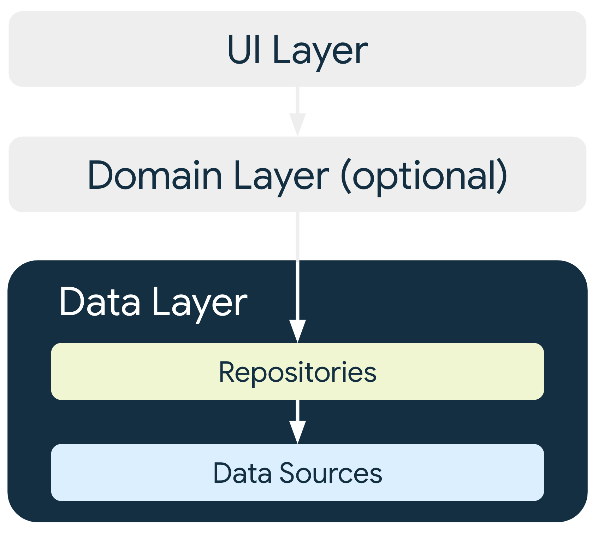

# PDM LEIC51D 2223i - Aula 12

O que é um SharedPreferences é um contentor de par chave valor, a.k.a key-value container, que é armazenado de forma persistente, portanto é armazenado no file system e que sobrevive ás execuções do processo
SharedPreferences
edit()
apply()
commit()

# PDM LEIC51D 2223i - Aula 13

LobbyActivity
Atualização da UI
Recomposição
Tem que estar dentro de um composable porque senão não acontece não fica associado a nenhuma recomposição
ViewModel é destruído ViewModelScope é cancelado
Cancelamento está implícito na destruição do ViewModel
Eu quero cancelar enquanto a activity não está visível como é que eu faço?
Com o uso do Job.
Quero entrar quando a activity/lobby sair quando activity deixar de estar visível
Como é que isso se faz?
Intercetando inventos de lifecycle
[Recommendations for Android architecture](https://developer.android.com/topic/architecture/recommendations)

- Dá a oportunidade de separar:
  - O objeto que tem alterações de estado
  - Com a forma como reagem a eles
    Caution: Manifestação da ideia de ter herança e polimorfismo com redefinição de métodos da base para fazer outras coisas, não é muito bom
Se quero observar alterações de estado registo um observador explicitamente
Utilização de MutableStateFlow

Começou a apresentar um modelo de interação entre a activity e o viewModel que é um modelo de interação híbrido no sentido em que por um lado faço chamadas ao viewModel e agora é o viewModel que é responsável por interrogar quem quer que seja para obter os dados para fornecer para cima, mas o modelo entre o viewModel e activity é reativo porque a activity reage alterações de dados que estão publicados no viewModel, ou seja, o viewModel faz __push__ dessa informação para a activity. Todavia, ele faz __pull__ da informação da fonte original, no caso o meu lobby. Porque é que ele do lobby não empurra os dados até cá acima? Utilização de flows. Porquê?? que maluco. Porque vai ser a forma generalizada para ter interfaces assíncronas, não propriamente apenas suspending functions mas também flows. A interface assíncrono é expressa em forma de um flow. Existem mais modelos de interação.
[Thinking in Compose](https://developer.android.com/jetpack/compose/mental-model)


Figure 1. The app logic provides data to the top-level composable function. That function uses the data to describe the UI by calling other composables, and passes the appropriate data to those composables, and on down the hierarchy.

Figure 2. The user interacted with a UI element, causing an event to be triggered. The app logic responds to the event, then the composable functions are automatically called again with new parameters, if necessary.

- This Modern App Architecture encourages using the following techniques, among others:

  - A reactive and layered architecture.
  - Unidirectional Data Flow (UDF) in all layers of the app.
  - A UI layer with state holders to manage the complexity of the UI.
    Coroutines and flows.
  - Dependency injection best practices.


Figure 3. The UI layer's role in app architecture.

- The UI layer is made up of two things:

  - UI elements that render the data on the screen. You build these elements using Views or Jetpack Compose functions.
  - State holders (such as ViewModel classes) that hold data, expose it to the UI, and handle logic.

Figure 4. The data layer's role in app architecture.

- Repository classes are responsible for the following tasks:

  - Exposing data to the rest of the app.
  - Centralizing changes to the data.
  - Resolving conflicts between multiple data sources.
  - Abstracting sources of data from the rest of the app.
  - Containing business logic.


Figure 4. The domain layer's role in app architecture.

- The domain layer is responsible for encapsulating complex business logic, or simple business logic that is reused by multiple ViewModels.

# PDM LEIC51D 2223i - Aula 14

ViewModel pede ao lobby, obtém e publica, ao publicar reativante a UI atualiza

Flow<List<PlayerInfo>>
O que acontece na linha temporal no lobby?

Num dado instante à um determinado conjunto de players num instante t1 o conjunto de players que estão no lobby é outro.
Flow -> A sequencia de snapshots ao longo do tempo

MutableStateFlow -> peça que viabiliza a adaptação de uma realidade a outra, isto é de um Flow a um MutableState que é o estado observável para forçar a recomposição, quando alterado.

collect-> para cada elemento do Flow publica no MutableStateFlow

```kotlin
lifecycleScope.launch{
    repeatOnLifecycle(Lifecycle.State.STARTED)
}
```

# PDM LEIC52D/LEIRT51D 2223i - Aula 16

Quando for para apagar fazer back para forçar a eliminação da collection lobby, porque terminar à bruta equivale a um crash e um crash não tem cleanup.

- Exemplo
  - Player 1 está a ver o Player 2 e vice-versa
  - O Player 1 altera o seu Moto e guarda
  - O Player 1 vê o Player 2
  - O Player 2 vê o Player 1, mas não consegue ver a alteração que foi feita no Player 1, ou seja, não atualiza.
Razão: Porque o viewModel vê o repositório quando foi instanciado

# PDM LEIC51D 2223i - Aula 17

Abordagem em subscrição clássica


When something happen is:
```kotlin
db.collection(LOBBY).addSnapshotListener{
  snapshot, error ->
    when {
      error != null -> {
        close(error)
        }
      snapshot != null -> {
        // Do something
        }
    }
}
```
O que é que este código diz: Olha é na API firestore quando houver alteração no ResultSet(conjunto de documentos que estão no Lobby), quando isso mudar executa o código __when{}__

O que é o Flow é algo que representa a sequência temporal

Este é o objeto que representa a sequência de acontecimentos

Estado do lobby ao longo do tempo

Flow<Any> -> retorna algo que representa a evolução temporal do estado do Any ao longo do tempo vai mudando

No ViewModel entra e pega naquele Flow __(.collect)__ "eu quero fazer coisas com isso"

```kotlin
match.startAndObserveGameEvents(localPlayer, matching).collect { 

  }
```

- __match.startAndObserveGameEvents(localPlayer, matching)__
  - __"I WANT"__
  - Momento de subscrição
  -Isto é vou entrar, neste caso entrar num __match__, e lança uma koroutine para começar o __match__

- __.collect__
  - __"HOW TO REACT"__
  - É uma abstração que significa o que é que eu quero fazer quando chegar um novo elemento, e enquanto eu estiver no __.collect__ estou sensivel, estou a reagir a chagadas de elementos, se o __.collect__ retornar acabou-se já não estou a reagir.

---
# Processo de subscrição, receção multipla e reação
---

